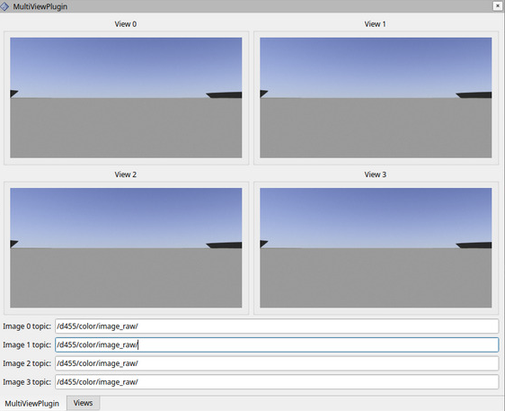
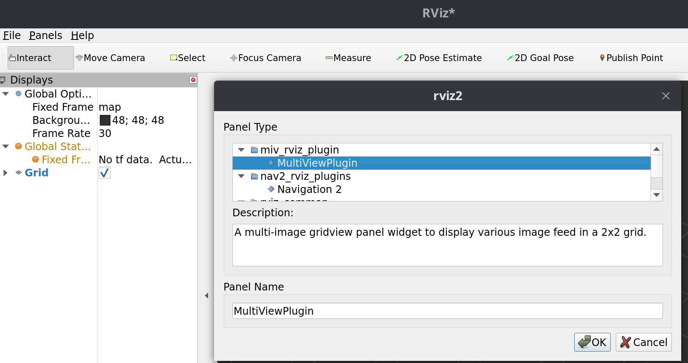

# Multi-Image View Rviz2 Plugin

A multi-image gridview panel widget to display various image feed in a 2x2 grid.

**Note:** This is a partial ROS2 port of the original Multi-Image View Rviz plugin. The port is currently WIP, and the plugin package **does not compile** for now.

> Currently support most 8bit image type for  **sensor_msgs/msg/Image/** message. ( `rgb8`, `rgba8`, `mono8`)



## Installation

Clone the repository into the `src` directory of your current workspace.

```bash
git clone https://github.com/quantumxt/miv_rviz_panel/ -b ros2
```

After that, compile and re-source the workspace.

```bash
cd ~/catkin_ws
colcon build --symlink-install --packages-select miv_rviz_panel
source ~/catkin_ws/install/setup.bash
```

The plugin should be available to be added into Rviz. (Through Panels > Add New Panel)




## License
<a href="LICENSE" ></a>
