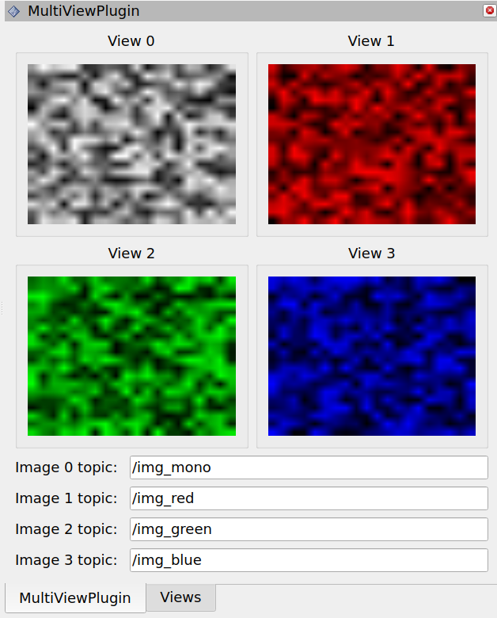
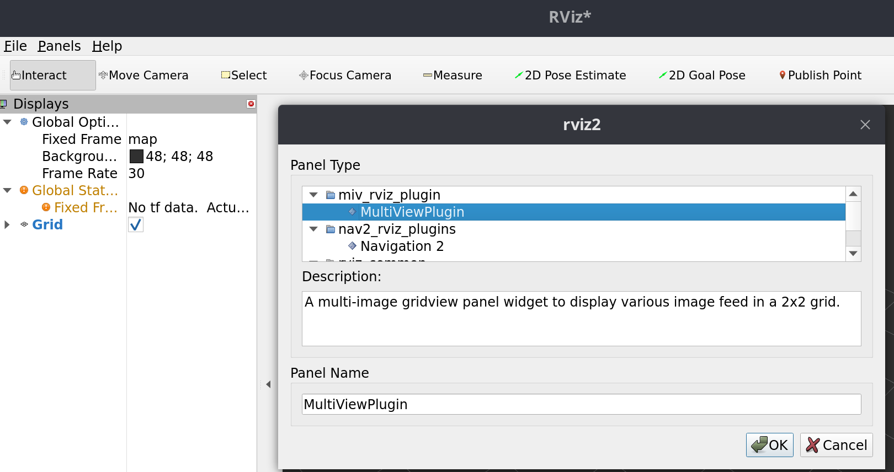

# Multi-Image View Rviz Plugin

A multi-image gridview panel widget to display various image feed in a 2x2 grid in RViz2.

> Support most 8bit image type for  **sensor_msgs/msg/Image/** message. ( `bgr8`, `rgb8`, `rgba8`, `mono8`)



## Installation

Clone the repository into the `src` directory of your current workspace.

```bash
git clone https://github.com/quantumxt/miv_rviz_panel/
```

After that, compile and re-source the workspace.

```bash
cd ~/catkin_ws
colcon build --symlink-install --packages-select miv_rviz_plugin
source ~/catkin_ws/install/setup.bash
```

Add the panel through: `Panels > Add New Panel`




## License
<a href="LICENSE" ></a>
